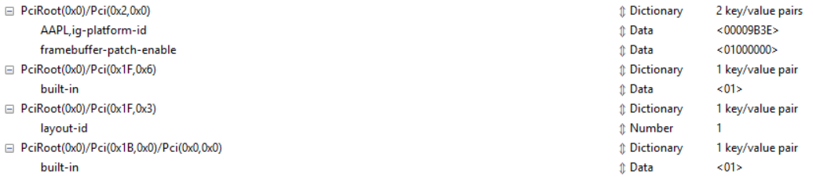

> Hardware

| CPU |  i5-10400 |
|  ----  | ----  |
| GPU |  CPU built-in Intel UHD Graphics 630 |
| 主板 |  Gigabyte B460M Aorus Pro|
| 声卡 |  Realtek ALCS1200A |
| 网卡 |  Intel I219V12 |
| 网卡 |  Wi-Fi6 AX200 - COMFAST AX200 SE |
| 蓝牙 |  Wi-Fi6 AX200 自带 |
| 内存 |  Fury DDR4 2666 8G |
| SSD  |  250G M.2| 
| 机箱 | Silver Stone PS15B-G |

> 功能 

| 核显 | 	正常，Display port |
|  ----  | ----  |
| 声卡  |	正常, id 为 1 |
| 网卡  | 	正常 | 
| 蓝牙	| 发正常，收不行 |
| 睡眠	| 正常 |
| USB   |     正常， 未用[USBMap](https://github.com/corpnewt/USBMap)定制 |
| airdrop  | 不行 |
| airprint |  不行| 
| appleid  | 能登录，但还没找到合法的SN [GenSMBIOS](https://github.com/corpnewt/GenSMBIOS) |

> [OpenCore 0.6.3](https://github.com/acidanthera/OpenCorePkg/releases)
* DeviceProperties 
    - must have PciRoot(0x0)/Pci(0x2,0x0) 
    - others need PCI location to decide
        - PciRoot(0x0)/Pci(0x1F,0x3) 主板网卡
        - PciRoot(0x0)/Pci(0x1F,0x6) 主板声卡
        - PciRoot(0x0)/Pci(0x1B,0x0)/Pci(0x0,0x0)  Wifi网卡带蓝牙
    - HDMI port need following modification in DeviceProperties  (not working)
        framebuffer-conX-enable = 01000000
        framebuffer-conX-type = 00080000
        X = 1 accroding to [IORegistryExplorer](https://github.com/khronokernel/IORegistryClone) 

* NVRAM
    - For sound card, add "alcid=xxx" in boot-arg will override the setting in DeviceProperties

* Boot without USB
    - (MountEFI](https://github.com/corpnewt/MountEFI)